# Urban Object Detection — VOC Fine-Tuned Models


Comparison of two object detection architectures fine-tuned on a manually annotated subset of the PASCAL VOC dataset.

**Models evaluated**

- YOLOv8n
- RT-DETR-l

**Target classes**

car • bus • bicycle • motorbike

---

## Overview

This project builds and evaluates object detection models trained on manually annotated images derived from the **PASCAL VOC 2012 dataset**.

Target classes:

| Class | Description |
|---|---|
| car | passenger vehicles |
| bus | large public transport vehicles |
| bicycle | human powered bicycles |
| motorbike | motorcycles |

The workflow includes:

1. dataset curation and manual annotation
2. model fine-tuning using pretrained detectors
3. evaluation using standard detection metrics
4. qualitative inspection of predictions

---

## Dataset

Source dataset:

PASCAL VOC 2012  
http://host.robots.ox.ac.uk/pascal/VOC/voc2012/

Original dataset characteristics:

| Property | Value |
|---|---|
| Images | ~17k |
| Format | Pascal VOC XML |
| Size | ~2GB |

For this project:

* only four classes were retained
* a subset of images containing those classes was selected
* all bounding boxes were **manually re-annotated**

---

## Annotation Process

Annotations were created using **CVAT (Computer Vision Annotation Tool)**.

Annotation format:

`bounding boxes`

Each object instance was labeled using one of the four classes.

Example annotated images (manual CVAT annotations):


Annotation statistics (train set):

| Class | Count |
|---|---|
| car | >= 25 |
| bus | >= 25 |
| bicycle | >= 25 |
| motorbike | >= 25 |

---

## Models

Two pretrained models were fine-tuned.

### Architecture Comparison

| Model | Type | Parameters | Strengths |
|---|---|---|---|
| YOLOv8n | One-stage CNN | ~3M | Fast, efficient, strong on small datasets |
| RT-DETR-l | Transformer detector | ~32M | Global context reasoning |

### YOLOv8n

Characteristics:
* fast inference
* lightweight architecture
* strong performance on small datasets

Pretrained weights: `yolov8n.pt`

### RT-DETR-l

Characteristics:
* global contextual reasoning
* stronger performance on complex scenes
* heavier model with slower inference

Pretrained weights: `rtdetr-l.pt`

---

## Evaluation Metrics

Performance is measured using standard object detection metrics.

### Precision

$$Precision = \frac{TP}{TP + FP}$$

Measures how many predicted objects are correct.

### Recall

$$Recall = \frac{TP}{TP + FN}$$

Measures how many real objects were detected.

### F1 Score

$$F1 = \frac{2PR}{P + R}$$

Balances precision and recall.

### mAP@0.5

Mean Average Precision at IoU = 0.5.
Measures detection accuracy using moderate overlap between predicted and ground truth boxes.

### mAP@0.5:0.95

COCO-style averaged precision across multiple IoU thresholds.
This metric is stricter and reflects localization quality.

---

## Results

Summary metrics computed on the **test set**.

| Model | mAP@0.5 | mAP@0.5:0.95 | Precision | Recall | Inference (ms/img) |
|---|---|---|---|---|---|
| YOLOv8n | 0.666 | 0.400 | 0.742 | 0.563 | 26.64 ± 3.40 |
| RT-DETR-l | 0.137 | 0.065 | 0.320 | 0.473 | 64.13 ± 2.16 |

*Note: Inference speed was benchmarked on a Google Colab T4 GPU, averaged over 20 test images at 640x640 resolution.*

Detailed per-class results are available in:

`reports/tables/evaluation/per_class_metrics.csv`

---

## Model Comparison

Performance comparison across the evaluated models.

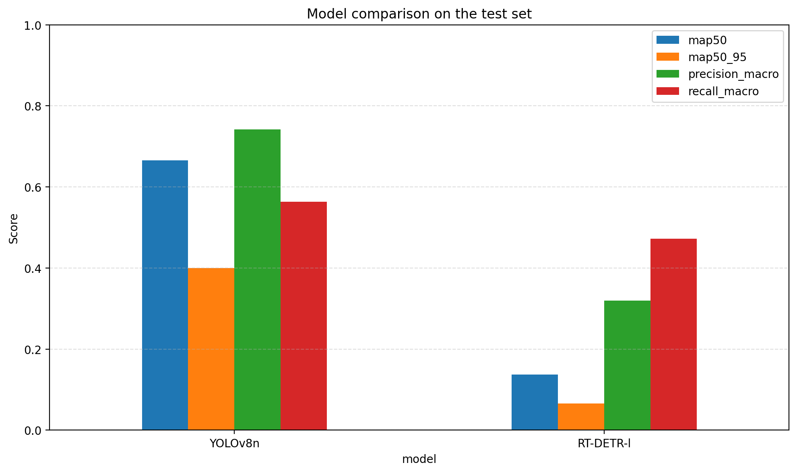

YOLOv8n demonstrates significantly stronger performance on the dataset, particularly in terms of mean Average Precision and overall detection stability.

---

## Training Curves

YOLO training curves:

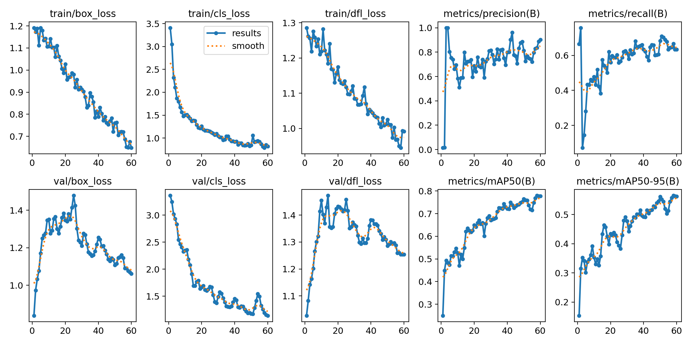

RT-DETR training curves:

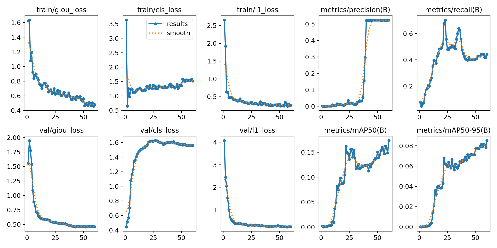

---

## Precision-Recall Behavior

YOLO:

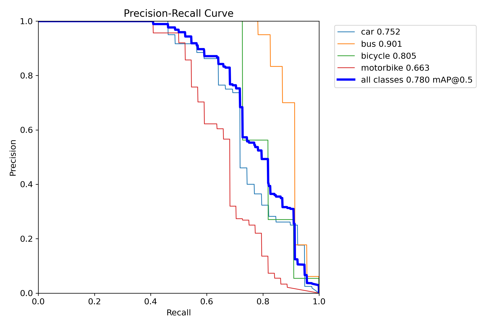

RT-DETR:

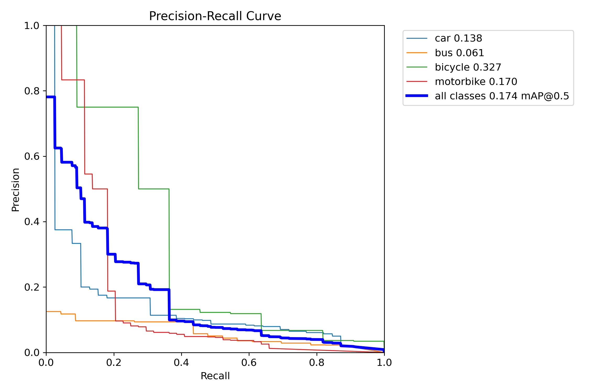

---

## Prediction Examples

### YOLOv8n predictions

| | | |
|---|---|---|
| 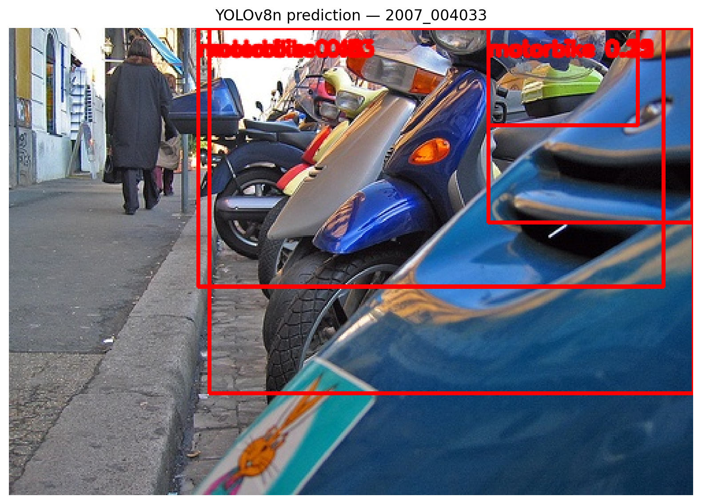 | 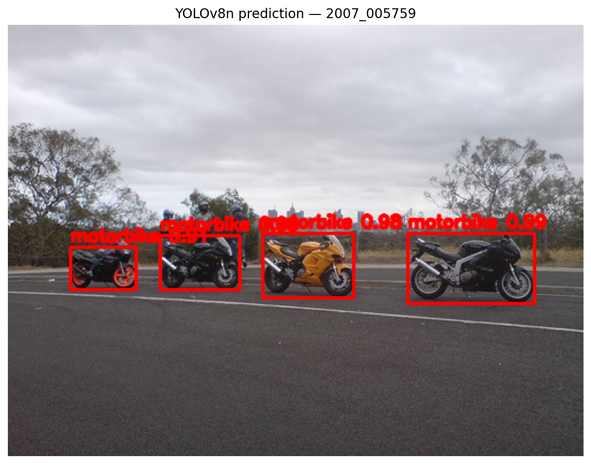 | 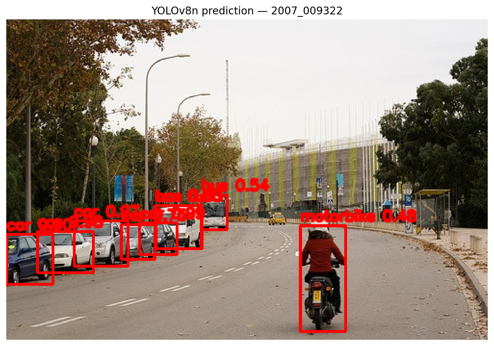 |

### RT-DETR predictions

| | | |
|---|---|---|
| 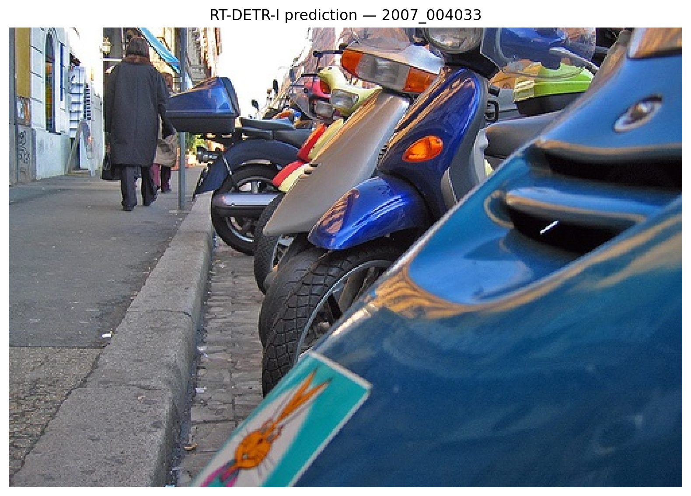 | 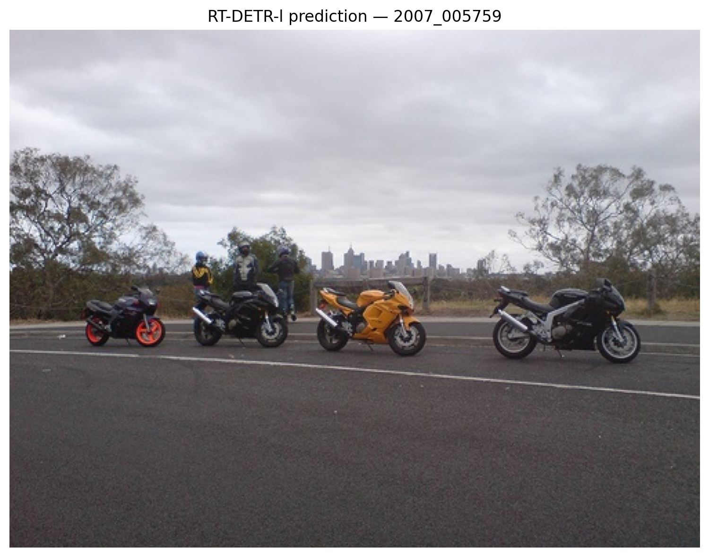 | 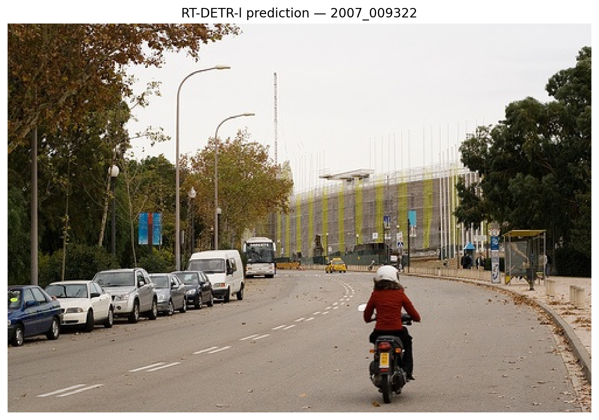 |

---

## Discussion

YOLOv8n significantly outperforms RT-DETR-l on this dataset.

Possible reasons:
* smaller CNN architecture adapts faster to limited data
* transformer-based detectors typically require larger datasets
* YOLO has strong inductive bias for object localization

RT-DETR remains powerful for large datasets with dense scenes but is harder to fine-tune under constrained annotation budgets.

---

## Error Analysis

Common failure cases observed:
* small bicycles partially occluded
* motorbikes overlapping with cars
* distant objects with low pixel resolution

These cases often lead to:
* missed detections
* incorrect class predictions
* low confidence scores

---

## Training Strategy and Design Choices

This project focuses on a controlled fine-tuning setup designed to compare two architectures under identical conditions. Both models were initialized from COCO-pretrained weights and trained on the same manually annotated dataset.

### Implemented Training Strategy

The following techniques were applied during fine-tuning.

#### Transfer Learning
Both detectors were initialized from pretrained weights:
* `yolov8n.pt`
* `rtdetr-l.pt`

This allows the models to reuse general visual features learned on large-scale datasets while adapting the detection head to the four target classes.

#### Controlled Hyperparameter Setup
The models were trained under comparable conditions on **GPU using Google Colab**:

| Parameter | Value |
|---|---|
| Input size | 640 x 640 |
| Epochs | 60 |
| Random seed | 42 |
| Dataset splits | train / val / test |

Batch sizes were adjusted to fit GPU memory constraints:

| Model | Batch |
|---|---|
| YOLOv8n | 16 |
| RT-DETR-l | 8 |

#### Optimization
Both models used AdamW-based optimization, which is widely used for modern detection architectures due to its stability with pretrained weights.

Learning rate choices:

| Model | Learning Rate |
|---|---|
| YOLOv8n | ~0.01 (auto selection) |
| RT-DETR-l | 0.0001 |

These values align with commonly recommended defaults for each architecture.

#### Data Augmentation
Training used the augmentation pipeline provided by the Ultralytics framework. Typical transformations included:
* random horizontal flips
* HSV color jitter
* scaling
* mosaic augmentation

These augmentations increase dataset diversity and improve generalization without modifying the underlying dataset.

### Techniques Considered but Not Applied

Several advanced techniques were intentionally not applied in order to keep the comparison controlled and reproducible.

#### Hyperparameter Search
No automated hyperparameter tuning was performed. Examples of omitted techniques:
* grid search
* Bayesian optimization
* population-based training

These methods can significantly improve model performance but introduce additional experimental complexity.

#### Advanced Data Augmentation
The following augmentations were considered but not implemented:
* CutMix
* MixUp
* copy-paste augmentation
* synthetic object insertion

Such methods can improve robustness but require careful tuning to avoid degrading bounding box quality.

#### Architecture Scaling
Larger versions of the models were not evaluated. Examples:
* YOLOv8s / YOLOv8m
* RT-DETR-x

The goal was to compare representative baseline models rather than maximize raw performance.

#### Extensive Training Schedules
Longer training schedules (100+ epochs) were also not used. Transformer-based detectors such as RT-DETR often benefit from longer training periods, but the goal here was to maintain a comparable training budget across architectures.

### Experimental Outcome
The results highlight an important practical observation. Lightweight CNN detectors such as YOLOv8n can outperform heavier transformer-based detectors when:
* the dataset is relatively small
* training time is limited
* annotations are sparse

Transformer detectors often require larger datasets and longer training schedules to fully exploit their modeling capacity.

---

## Repository Structure

```text
voc-object-detection-yolo-rtdetr/
├── agent_documentation/
├── artifacts/
├── data/
├── notebooks/
│   ├── 01_data_prep.ipynb
│   ├── 02_training_yolov8n.ipynb // made for colab
│   ├── 02_training_rtdetr.ipynb // made for colab
│   ├── 03_evaluation.ipynb
│   └── 03_gpu_evaluation.ipynb // made for colab
├── reports/
│   ├── figures/
│   └── tables/
├── src/
│   ├── config.py
│   ├── cvat_io.py
│   ├── make_bundle.py
│   ├── sampling.py
│   ├── splits.py
│   ├── utils.py
│   ├── validation.py
│   └── voc.py
├── .gitignore
├── bundle_manifest.txt
├── README.md
└── requirements.txt
```

### Directory overview
* **`agent_documentation/`** — planning notes, requirement references, and development documentation.
* **`artifacts/`** — saved model outputs, plots, training logs, and exported experiment artifacts.
* **`data/`** — final dataset used for training and evaluation, including images, labels, and dataset configuration.
* **`notebooks/`** — end-to-end notebooks for data preparation, model training, and evaluation.
* **`reports/figures/`** — generated visual outputs such as training curves, PR curves, confusion matrices, and prediction examples.
* **`reports/tables/`** — saved metric tables and evaluation summaries.
* **`src/`** — reusable helper modules for dataset parsing, CVAT import, sampling, splitting, validation, and packaging.

### Key notebook roles
* **`01_data_prep.ipynb`** — dataset filtering, subset selection, CVAT integration, split creation, and final dataset export.
* **`02_training_yolov8n.ipynb`** — fine-tuning and checkpointed training for YOLOv8n.
* **`02_training_rtdetr.ipynb`** — fine-tuning and checkpointed training for RT-DETR-l.
* **`03_evaluation.ipynb`** — test-set evaluation, metric aggregation, qualitative comparison, and visualization generation.
* **`03_gpu_evaluation.ipynb`** — dedicated execution for GPU inference benchmarking and timing extraction.

*Note: **`02_training_yolov8n.ipynb`**, **`02_training_rtdetr.ipynb`**, and **`03_gpu_evaluation.ipynb`** notebooks were meant to be run in Google Colab; the required set-up for those notebooks is also mentioned in their corresponding Markdown cells.*

### Key source modules
* **`config.py`** — project-wide paths, constants, and configuration values.
* **`voc.py`** — parsing and summarizing PASCAL VOC annotations.
* **`sampling.py`** — balanced subset selection for manual annotation.
* **`cvat_io.py`** — CVAT export parsing and label attachment logic.
* **`splits.py`** — deterministic train/validation/test split generation.
* **`validation.py`** — dataset integrity checks and summary utilities.
* **`utils.py`** — shared helper functions for file and metadata operations.
* **`make_bundle.py`** — minimal dataset bundle creation for Colab-based training.


---

## Tools

| Tool | Purpose |
|---|---|
| Python | model development |
| Ultralytics | training and evaluation |
| CVAT | dataset annotation |
| OpenCV | visualization |
| PyTorch | deep learning backend |

---

## LLM Usage

Documentation of AI assistance used during development is available in:

`agent_documentation/llm_usage.md`

---

## License

MIT License

Copyright (c) 2026

Permission is hereby granted, free of charge, to any person obtaining a copy of this software and associated documentation files to deal in the Software without restriction.